# Architecture

## Safety model

```mermaid
flowchart LR
    A["Untrusted PDF, DOCX, Markdown, or TXT"] --> B["Bounded parser and stable spans"]
    B --> C["Corpus-scoped PostgreSQL retrieval"]
    C --> D["Claim extraction adapter"]
    D --> E["Deterministic evidence validator"]
    E --> F["Conflicts and relevant YAML rules"]
    F --> G["Persisted proposal, conflict, and finding review items"]
    G --> H["Durable item-by-item LangGraph interrupt"]
    H --> I["Optimistic register commit"]
    I --> J["Versioned hashes, dependency edges, timeline"]
```

Documents are always data. They cannot choose tools, alter policy, access credentials, or bypass review. A claim produced by either the deterministic or live model adapter is reloaded from PostgreSQL and must reproduce from its exact cited span before it can become a proposal.

## Durable boundaries

- PostgreSQL owns corpora, immutable source-version bytes, spans, FTS/vector indexes,
  register versions, proposals, conflicts, rule results, the unified review ledger and
  decisions, watcher reservations, dependency edges, stages, and checkpoints.
- `thread_id == run_id` is the durable LangGraph cursor.
- The human-review node uses a persisted interrupt. A restart reconstructs the graph and resumes the same proposal set.
- Commit increments the register with optimistic locking. A stale run cannot overwrite a newer version.
- Source versions are marked with the register version in which they were analyzed. Later runs scan only unanalyzed source versions and rules relevant to affected record types.

## Interface boundary

FastAPI and MCP v2 are transport adapters over one `DurableProjectDeliveryService` instance. They validate/translate data but do not query PostgreSQL directly. The React client uses REST; MCP clients reach the same service at `/mcp/` using Streamable HTTP.

## Retrieval capability

The baseline always provides entity-key lookup and PostgreSQL full-text search. If
`CREATE EXTENSION vector` succeeds, source spans also receive deterministic local
embeddings and pgvector cosine-distance rankings enter reciprocal-rank fusion. If the
extension is absent or cannot be installed, the same service continues with exact/FTS.

## Current graph granularity

The durable mutation core has three physical LangGraph nodes: preparation, human
review, and commit. The timeline nevertheless records INGEST, RETRIEVE_OR_PLAN,
CONFLICTS, RULES, HUMAN_REVIEW, and COMMIT independently with timings and route status.
Preparation components are not individually resumable graph nodes.
